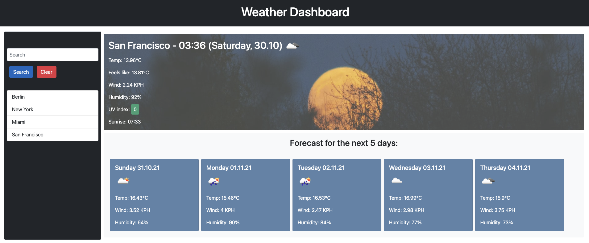
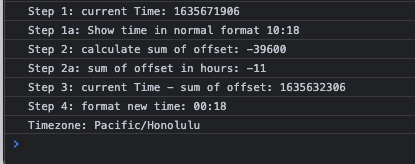

# Homework06WeatherDashboard

This is the repository to hand in the homework from week 6

# Acknowledgements

- This week homework submission builds on the work from Suraj Verma
- [Copied Repo](https://github.com/surajverma2587/weather-dashboard/tree/dev)
- [Picture used for Daytime background](https://unsplash.com/photos/sAtNmpS66n4), thanks to Janaine Arioli for the picture
- [Picture used for Nighttime background](https://unsplash.com/photos/vhInzGLpnyI), thanks to Noah Silliman for the picture

Thanks a lot for the initial work that helps us to focus on the Project 1 Phase.

# Links to the files

- [GitHub Repository](https://github.com/laeuler/Homework06WeatherDashboard)
- [GitHub Page](https://laeuler.github.io/Homework06WeatherDashboard)
- [API Documentation](https://openweathermap.org/api/one-call-api)

# Technolgies used

- HTML
- CSS, Bootstrap
- JavaScript, jQuery

# Adjustments made & Mockup

There've been several adjustments made in comparison to the original code

- The UI differentiates stronger between navigation, usable components and forecast by darker color
- a clear recent cities option was added to improve usability
- when the user hovers over the recent cities, visual feedback implies that you can click on it (color change)
- when you search for a city (click on search button), the search field is cleared
- Cities with two words ran intro problems when accessing them through the recent cities list (cityName = target.data("City") before). That was adjusted (cityName = target.text())
- forecast is now displayed in metric units (previously imperial)
- the current forecast card at the top was subjected to several changes
  - Time and date are now reffering to the time of the city, not the local time of the user
  - UV index color coding is now using a class not associated with button behavior
  - felt temperature was added
  - depending on the local time of the city it determined wether it is daytime or night time and the background of the card is adjusted accordingly + either next Sunrise or Sunset time is displayed as well
  - local times are calculated through the timezone offset from the API UTC offset of the user
- forecast cards for the next 5 days are aligned to the left
- JavaScript code is now commented

# Calculating local Times - a funny learning experience

Situation: I wanted to display in the current forecast card the local time of the city searched, not the local time of the user.

### Version 1: the basic idea

- I fetched the timezone offset from the open weather API
- deducting the current offset and correcting it with a hardcoded factor (in my case 7200 for Berlin)

### Version 2: the insight & adjustments

- this morning I woke up and realized Summer Time ended
- so I knew I had to adjust the hardcoded factor to 3600, my initial plan

### Version 3: making it smarter

- At first I went for the hardcoding of the correction path, because the API didn't offer me such an factor
- then I realized the factor is nothing more than UTC offset for my very own local time (or the one from the user)
- and tada, I remembered there is a function through moment.js (utcOffset)
- Side mark: it is Sunday, 9am - this will become relevant later

### Version 4: strange things happen

- I implemented the variable local offset through moment.js and it worked for all cities - almost
- When I searched for San Francisco, or Seattle it strangely didn't add up
- I double checked dozen of times the order of my arguments
  - am I substracting in the right order
  - should I work with absolutes
  - is this the case for negative absolutes ("No it works for New York")
- I went on a console.log spree (example below for Honolulu to replicate it)

- my head broke
  - it is 9:30 in Berlin
  - Offset for me is 1h
  - Offset for SF is 7h
  - sum of offset is 8h
  - so the calculation of 9:30-8h is...2:30 ("What?!)
- I wasn't sure who to trust anymore, how could math be so misleading, how does this happen and went for a coffee
- during the coffee I decided on my last move with regards to this: "I will get the timezone name (accessible through the API), lets see if that leads to something"
- entering the desk at 10:02 am, coded the console.log for the timezone and...it worked

So this was the moment it hit me! End of summer time ends at 2am in the morning and it was reflected everywhere beside...yeah beside the cities in timezones earlier than 2am, or on every city on the west coast.

Key Learning and best practice to my future self: Don't, never ever, work with timezone cacluation around the end of summer or winter time. Just don't do it :-)

# Closing Remarks

The provided code we could build on helps a lot to understand the logic flow and thinking used when using APIs, asynchronous JavaScript components.

Thank you very much for that.

Looking forward to the feedback

Lars
